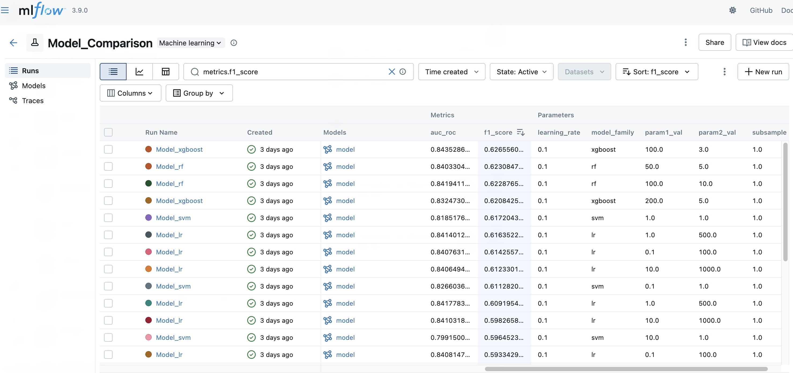
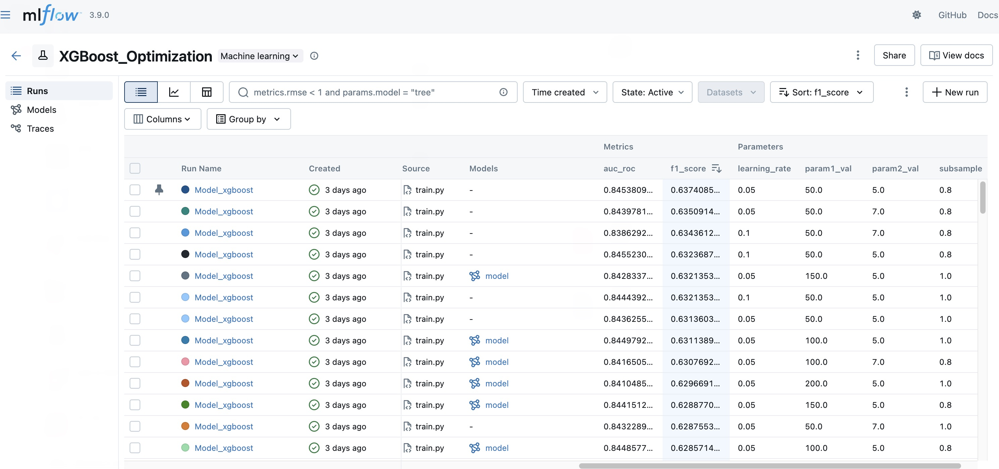
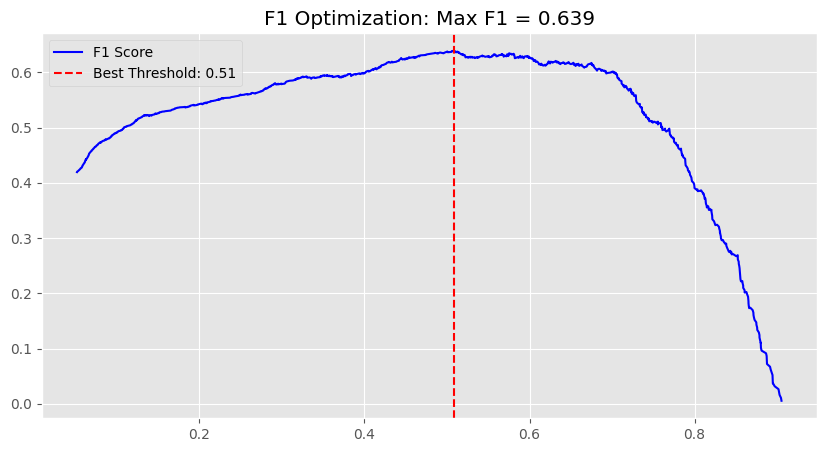
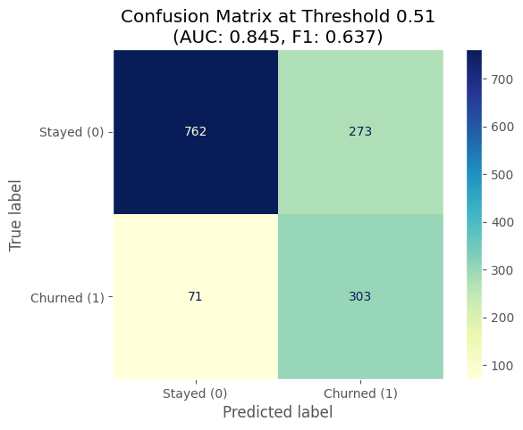

## 🎯 Project Goal

The objective of this project is to build a production-style churn prediction system that:

- Identifies customers at high risk of cancellation  
- Handles class imbalance in a principled way  
- Compares multiple model families  
- Tracks experiments using MLflow  
- Selects and registers the best-performing model  
- Optimizes decision thresholds for business tradeoffs  

Unlike a simple notebook-based modeling exercise, this project demonstrates a structured ML lifecycle workflow:

**EDA → Preprocessing → Multi-model comparison → Hyperparameter tuning → Model selection → Registry**

The final production candidate is an optimized, class-weighted **XGBoost** model, tuned to balance churn detection and intervention cost.

## 📂 Repository Structure

The repository is organized to reflect a clean, production-oriented machine learning workflow:

```text
.
├── data/
│   └── raw_data.csv              # Original Telco Churn dataset
│
├── notebooks/
│   └── EDA.ipynb                 # Exploratory data analysis and business insights
│
├── src/
│   ├── preprocess.py             # Data cleaning, encoding, scaling, train/test split
│   ├── train.py                  # Unified training script with MLflow logging
│   ├── hpo.py                    # Multi-model hyperparameter sweep
│   ├── xgb_finetune.py           # Fine-grained XGBoost hyperparameter tuning
│   ├── register_model.py         # Automated best-model registration to MLflow Registry
│   └── save_best_model.py        # Export finalized production model after business validation
│
├── models/                       # Stored production-ready model artifacts (.pkl)
│
├── MLProject                     # MLflow project definition
├── conda.yaml                    # Reproducible environment specification
├── README.md                     # Project documentation
└── .gitignore                    # Ignore artifacts and cache files

```
This structure separates experimentation, model training, tracking, and production artifacts — mirroring how ML systems are organized in real-world environments.

## 📊 Dataset & Problem Framing

This project uses the **Telco Customer Churn dataset**, where each row represents a telecom customer and the target variable indicates whether the customer churned.

### Dataset Overview

- ~7,000 customers
- Binary classification problem
- Churn rate: **~26.5%**
- Mix of numerical and categorical features
- Behavioral and billing-related attributes

Because churners represent a minority class, this is an **imbalanced classification problem**.

If not handled properly, models tend to over-predict the majority class (non-churn), leading to high accuracy but poor churn detection.


## ⚖️ Handling Class Imbalance

To address imbalance, this project applies:

- **Class weighting during training**
  - `scale_pos_weight` for XGBoost
  - `class_weight='balanced'` for other models
- **Threshold tuning on predicted probabilities**
  - Final optimized threshold: **0.51**

This ensures the model prioritizes identifying churners (high recall) while controlling unnecessary intervention costs (precision tradeoff).


## 🔍 Exploratory Data Analysis (EDA)

Detailed exploratory analysis is documented in `notebooks/EDA.ipynb`.

Key high-level observations:

- Month-to-month contracts exhibit significantly higher churn.
- Short-tenure customers are substantially more likely to leave.
- Higher monthly charges increase churn probability.
- Greater service adoption correlates with lower churn.
- Certain payment methods (e.g., electronic check) show elevated churn rates.

These behavioral insights informed feature engineering choices, imbalance handling, and threshold selection strategy.

## 🔁 Model Lifecycle

This project follows a structured ML workflow beyond simple notebook experimentation, covering model comparison, optimization, and production readiness.

### 1️⃣ Model Comparison

Multiple model families (Logistic Regression, Random Forest, SVM, XGBoost) were evaluated under a unified preprocessing pipeline.

All experiments were tracked in MLflow, logging hyperparameters and key metrics (AUC, F1, Precision, Recall).

**XGBoost delivered the strongest baseline performance.**




### 2️⃣ Imbalance-Aware Training

Given the 26.5% churn rate, class imbalance was addressed during training:

- `scale_pos_weight` (XGBoost)  
- `class_weight='balanced'` (LR, RF, SVM)  

This increases the penalty for misclassifying churners and improves recall.


### 3️⃣ XGBoost Optimization

A dedicated hyperparameter search refined:

- `n_estimators`
- `max_depth`
- `learning_rate`
- `subsample`

All runs were logged in MLflow for reproducible comparison.



Model selection was primarily based on **maximum F1 score** rather than AUC alone.

While AUC measures overall ranking ability, it is threshold-independent.  
Churn intervention decisions operate at a fixed threshold, making **F1 (precision–recall balance)** a more deployment-relevant metric.

AUC was used to confirm separability, while F1 served as the primary selection criterion.


### 4️⃣ Operating Threshold Selection

Rather than assuming the default 0.5 cutoff is optimal, 
predicted probabilities were evaluated across thresholds to identify the best operating point.

The selected threshold (~0.5) maximized F1 under class-weighted training, 
confirming that the model’s optimal decision boundary aligns closely with the default midpoint.



### 5️⃣ Model Registry & Production Export

The best-performing run was registered in MLflow for version tracking and experiment lineage.

After business validation, the finalized production model can be exported via:

`src/save_best_model.py`

The deployment-ready artifact is stored under:

`models/`


### 🔄 Workflow Summary

EDA  
→ Preprocessing  
→ Multi-Model Comparison  
→ Hyperparameter Optimization  
→ Threshold Tuning  
→ Registry  
→ Production Export

## 📊 Final Model Performance & Business Interpretation

The best-performing XGBoost model (class-weighted, threshold = 0.51) achieved:

- **AUC:** 0.845  
- **F1 Score:** 0.637  
- **Accuracy:** ~0.79  
- **Recall:** ~0.81  
- **Precision:** ~0.53  

### Confusion Matrix at Threshold 0.51



|                | Predicted Stay | Predicted Churn |
|----------------|---------------|----------------|
| **Actual Stay**   | 762 (TN)       | 273 (FP)        |
| **Actual Churn**  | 71 (FN)        | 303 (TP)        |

---

### 📈 Metric Interpretation (Business Perspective)

**True Positives (303)**  
Correctly identified churners.  
→ Enables targeted retention campaigns and revenue protection.

**True Negatives (762)**  
Correctly identified loyal customers.  
→ Avoids unnecessary discount or outreach cost.

**False Positives (273)**  
Customers predicted to churn but who stayed.  
→ Increases intervention cost, but may still strengthen engagement and long-term loyalty.

**False Negatives (71)**  
Missed churners.  
→ Direct revenue loss and missed retention opportunity.

---

### 🎯 Why These Metrics Matter

- **Recall (~0.81)** ensures most churners are captured, protecting revenue.
- **Precision (~0.53)** controls over-spending on unnecessary retention efforts.
- **F1 Score (0.637)** balances these two competing objectives.
- **AUC (0.845)** confirms strong overall ranking ability.

Because churn intervention operates at a fixed threshold, evaluation focuses on precision–recall tradeoffs rather than accuracy alone.

---

### 🔎 Business Takeaway

The model captures over 80% of churners while maintaining manageable intervention cost.  
This makes it suitable for deployment in retention targeting workflows where recall is prioritized over pure accuracy.
